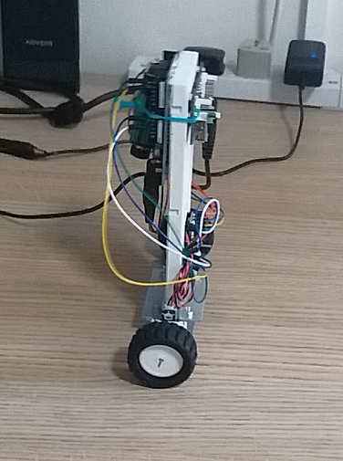

# Two-wheeled Self Balancing Robot (PID controlled)

This repository records the Arduino codes written to drive the robot. `RealRobot.ino` is the main program which calls functions defined in all other `.ino` files. Click link below for a demo video for the resulting robot prototype:

https://drive.google.com/file/d/1OyKDlM64LwiWncTTQ7JdOwpjYcJzZo41/view?usp=sharing

  

